# sahen

Student developer in Japan — web, runtimes, systems, and algorithms.

 

&nbsp;
&nbsp;

 

## Selected work

<table>
<tr>
<td width="33%" valign="top">

  

<h3 align="center"><a href="https://github.com/sahenjp/aegis-acbs">Aegis ACBS</a></h3>

Exact bidirectional shortest-path search with reproducible benchmarks.

Go · graph algorithms · benchmarking

</td>
<td width="33%" valign="top">

  

<h3 align="center"><a href="https://github.com/sahenjp/Nelo">Nelo</a></h3>

Request-owned tasks, cancellation, and resource lifetimes for TypeScript.

TypeScript · Web Standards · Node.js / Deno

</td>
<td width="33%" valign="top">

  

<h3 align="center"><a href="https://github.com/sahenjp/lvau">Lvau</a></h3>

Local file encryption with a CLI, native GUI, and versioned format.

Rust · XChaCha20-Poly1305 · Argon2id

</td>
</tr>
</table>

 

## Stack

  
  &nbsp;&nbsp;
  
  &nbsp;&nbsp;
  
  &nbsp;&nbsp;
  
  &nbsp;&nbsp;
  
   
  TypeScript · Rust · Go · Python · React

 

## Activity

<picture>
  <source media="(prefers-color-scheme: dark)" srcset="./activity/lifetime.dark.svg" />
  
</picture>

 

## Listening

  

