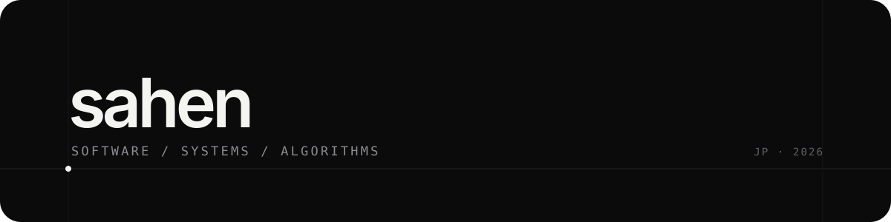

  

  <a href="https://sahen.jp">sahen.jp</a>

## 01 / Selected work

### [Aegis ACBS](https://github.com/sahenjp/aegis-acbs) ↗
Exact bidirectional shortest-path search with a shared proof of optimality.  
graph algorithms · routing · reproducible research

### [Nelo](https://github.com/sahenjp/Nelo) ↗
A runtime-aware web framework built around explicit request lifetimes and delivery scopes.  
TypeScript · web runtimes · lifecycle semantics

### [Lvau](https://github.com/sahenjp/lvau) ↗
File-encryption tooling written in Rust.  
Rust · cryptography tooling · CLI

---

## 02 / Working on

Algorithms, systems software, security, and developer tooling.

I care about small interfaces, reproducible results, and software whose behavior can be explained rather than guessed.

---

Japan · <a href="https://sahen.jp">sahen.jp</a>
